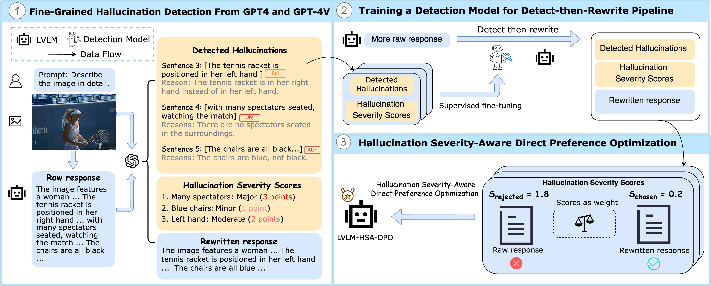

<!-- # magic-edit.github.io -->

<p align="center">
  <h2 align="center">[AAAI 2025] Detecting and Mitigating Hallucination in Large Vision Language Models via Fine-Grained AI Feedback
</h2>
  <p align="center">
    <a><strong>Wenyi Xiao<sup>1*</sup> , </strong></a>
    <a><strong>Ziwei Huang<sup>1*</sup> , </strong></a>
    <a><strong>Leilei Gan<sup>1†</sup> , </strong></a>
    <a><strong>Wanggui He<sup>2</sup>  </strong></a>
    <br>
    <a><strong>Haoyuan Li<sup>2</sup> ,  </strong></a>
    <a><strong>Zhelun Yu<sup>2</sup> , </strong></a>
    <a><strong>Fangxun Shu<sup>2</sup> ,  </strong></a>
    <a><strong>Hao Jiang<sup>2</sup> , </strong></a>
    <a><strong>Linchao Zhu<sup>1</sup>   </strong></a>
    <br>
    <sup>1</sup> Zhejiang University&nbsp;&nbsp;&nbsp;&nbsp;&nbsp;&nbsp;<sup>2</sup> Alibaba Group&nbsp;&nbsp;&nbsp;&nbsp;&nbsp;&nbsp
    <br>
    <sup>*</sup>Equal contribution &nbsp;&nbsp;&nbsp;&nbsp;&nbsp;&nbsp <sup>†</sup>Corresponding author
    </br>
    </br>
        <a href="https://arxiv.org/pdf/2404.14233">
        </a>
        <a href="https://huggingface.co/datasets/WenyiXiao/HSA-DPO">
        </a>
        <a href="https://modelscope.cn/models/xiaowenyi/HSA-DPO">
        </a>
        
  </p>
</p>


## Overview

This repository contains the official implementation of the paper "Detecting and Mitigating Hallucination in Large Vision Language Models via Fine-Grained AI Feedback". For supplementary experiments and details, please refer to the [Appendix](asset/HSA_DPO_Appendix.pdf).

This working copy now has two layers:

- the original `hsa_dpo/` package and training flow from the released paper
- a lightweight `fg_pipeline/` extension layer for the new confidence-aware pipeline

Design rule for this project:

- keep the original HSA-DPO code and dataset paths intact
- reuse `hsa_dpo_train.sh` and `hsa_dpo/models/llava-v1_5/train_dpo.py` whenever possible
- add new logic around the old pipeline instead of replacing it



## Table of Contents

- [Overview](#overview)
- [Installation](#installation)
- [Vast AI](#vast-ai)
- [Dataset](#dataset)
- [Training](#training)
- [Evaluation](#evaluation)
- [Citation](#citation)

## Installation

```bash
git clone https://github.com/Mr-Loevan/HSA-DPO.git
cd HSA-DPO

# Install HSA-DPO and dependencies
conda create -n hsa_dpo python==3.10
conda activate hsa_dpo
pip install -e .

# Linux GPU training stack
pip install -e ".[linux-train]"
```

## Vast AI

For a repo-specific Vast AI workflow, see [VAST_AI_SETUP.md](VAST_AI_SETUP.md).

## Dataset

### Download Dataset
```bash
pip install -U huggingface_hub

# Download all dataset files
hf download --repo-type dataset WenyiXiao/HSA-DPO --local-dir ./datasets
```

### Dataset Organization

**For hallucination detection:** 
- Training data: `hsa_dpo_detection.jsonl`
- Images: from [Visual Genome](https://homes.cs.washington.edu/~ranjay/visualgenome/api.html), stored under `./vg/images`

**For hallucination mitigation (HSA-DPO training):** 
- Preference data: `hsa_dpo_preference_llava1dot5.jsonl` 
- Images: extracted into `./hsa_dpo/data/images`

**Optional external data (not used by default):**
- `VLFeedback/` is not part of the default repo flow
- keep it outside the main pipeline unless you explicitly decide to use it as auxiliary preference data

### Prepare Data for Training

```bash
# 1. Create data directories
mkdir -p hsa_dpo/data
mkdir -p hsa_dpo/data/images
mkdir -p vg/images

# 2. Copy preference dataset
cp datasets/hsa_dpo_preference_llava1dot5.jsonl hsa_dpo/data/

# 3. Extract images
tar -xzf datasets/hsa_dpo_imgs.tar.gz -C hsa_dpo/data/images/

# 4. Verify data structure
ls hsa_dpo/data/
# Should show: hsa_dpo_preference_llava1dot5.jsonl and images/

ls hsa_dpo/data/images/ | head -5
# Should show: 0.jpg, 1.jpg, 2.jpg, 3.jpg, 4.jpg ...
```

**Note:** The images are named with sequential IDs (0.jpg, 1.jpg, ...) corresponding to the `id` field in the JSONL file.

**Important:** the repo uses two different image stores:

- `vg/images/` for the detection dataset
- `hsa_dpo/data/images/` for preference training

Do not merge them.

## Training

### Prerequisites

1. Install the HSA-DPO package:
```bash
pip install -e .
```

2. Prepare dataset following the instructions above (see [Dataset](#dataset) section)

3. Download the base LLaVA-v1.5 model:
```bash
# Download LLaVA-v1.5-13B model
hf download liuhaotian/llava-v1.5-13b --local-dir ./models/llava-v1.5-13b

# The CLIP vision encoder will be auto-downloaded during training
```

### Running Training

We provide a training script for HSA-DPO with LLaVA-v1.5:

```bash
# Configure paths in hsa_dpo_train.sh
vim hsa_dpo_train.sh

# Update these paths according to your setup:
# DATA_PATH="./hsa_dpo/data/hsa_dpo_preference_llava1dot5.jsonl"
# IMAGE_FOLDER="./hsa_dpo/data/images"
# MODEL_PATH="path/to/llava-v1.5-13b"
# OUTPUT_DIR="./output/hsa_dpo_llava"

# Run training
bash hsa_dpo_train.sh
```

## Project Extension Pipeline

The new project work lives under `fg_pipeline/` and reuses the original HSA-DPO code.

Current stage launchers:

```bash
bash scripts/run_stage3_confidence.sh
bash scripts/run_stage3_calibrate.sh
bash scripts/run_stage4_rewrite.sh
bash scripts/run_stage5_select_threshold.sh
bash scripts/run_stage5_verify.sh
bash scripts/run_calibrated_pipeline.sh
bash scripts/run_stage6_train.sh
```

Evaluation launchers:

```bash
bash scripts/run_paper_eval.sh
bash scripts/run_general_eval.sh
python -m fg_pipeline.eval.run_eval --help
```

What these stages do today:

- Stage 3 runs confidence-aware detection, then calibrates the stored severity log-probs into `D_det_calibrated.jsonl` and a group-conditional threshold report
- Stage 4 rewrites with either a smoke-only `template` backend or the real `llava` backend; it can use either a global `tau` or the calibrated threshold report
- Stage 5 selects `tau_c` with CRC / CV-CRC and then verifies pairs into `D_pref_clean_grouped.jsonl`
- Stage 6 reuses the original HSA-DPO training stack, now reads Stage 5 `image` paths directly, and by default applies `severity_weight` inside the DPO rejected term as the paper-style adaptive objective

Current status:

- Stage 3-6 are implemented at the repo level
- the recommended end-to-end entrypoint is `bash scripts/run_calibrated_pipeline.sh`
- the current Stage 5 verifier is heuristic, so CRC / CV-CRC guarantees are relative to that verifier rather than absolute ground truth
- the paper-like Stage 6 configuration should be run on a real 2-GPU box; the current 1x 32 GB setup is expected to OOM

### Key Parameters

- `use_chosen_score`: Whether to use chosen scores in DPO loss (default: False)
- `use_rejected_score`: Whether to use rejected scores in DPO loss (default: True in the Stage 6 wrapper so `severity_weight` enters the inner adaptive DPO objective)
- `use_adaptive_example_weight`: Whether to also apply outer example weighting after the inner DPO loss (default: False; enable only for an intentional stronger variant)
- `beta`: Temperature parameter for DPO loss (default: 0.1)
- `num_train_epochs`: Number of training epochs (default: 2)
- `per_device_train_batch_size`: Batch size per GPU (default: 8)
- `learning_rate`: Learning rate (default: 2e-6)

### Multi-GPU Training

The script supports multi-GPU training with DeepSpeed. Adjust `NUM_GPUS` in the script:

```bash
NUM_GPUS=2  # Use 2 GPUs
bash hsa_dpo_train.sh
```

For the calibrated extension pipeline on a suitable multi-GPU machine:

```bash
RUN_STAGE6=true MODEL_PATH=models/llava-v1.5-13b IMAGE_ROOT="$(pwd)" bash scripts/run_calibrated_pipeline.sh
```

## Evaluation

### Download Model Weights

```bash
pip install -U modelscope
modelscope download --model xiaowenyi/HSA-DPO --local-dir ./checkpoints
```

### Evaluation Suite

The repo now has a project-owned evaluation layer under `fg_pipeline/eval/`.

It supports two modes:

- **Paper core**: benchmark comparison against the referenced paper
- **General eval**: Stage 3-6 internal metrics plus any selected public benchmarks

The intended 3-way comparison is:

- base `LLaVA-1.5-13B`
- your local improved model
- the referenced paper’s reported numbers as a fixed overlay

Judge-based metrics are in scope from v1. They require `OPENAI_API_KEY` plus `OPENAI_JUDGE_MODEL` or `--openai-judge-model`.

### Model Manifest

The evaluation runner expects a JSON manifest:

```json
[
  {
    "model_id": "llava15_base_13b",
    "model_path": "models/llava-v1.5-13b",
    "model_base": null,
    "kind": "base",
    "conv_mode": "vicuna_v1",
    "temperature": 0.0,
    "num_beams": 1,
    "max_new_tokens": 512
  },
  {
    "model_id": "ours_stage6_lora",
    "model_path": "output/fghd/adaptive_dpo",
    "model_base": "models/llava-v1.5-13b",
    "kind": "lora",
    "conv_mode": "vicuna_v1",
    "temperature": 0.0,
    "num_beams": 1,
    "max_new_tokens": 512
  }
]
```

Supported model kinds:

- `base`
- `lora`
- `merged`

### Paper-Core Benchmarks

The paper-core wrapper defaults to:

- `mhalubench`
- `mfhallubench`
- `object_halbench`
- `amber`
- `mmhal_bench`
- `pope_adv`
- `llava_bench_wild`
- `hss`

Current implementation shape:

- `pope_adv`, `llava_bench_wild`, `mmhal_bench`, `hss` are working project-owned adapters
- `object_halbench` and `amber` expect normalized local benchmark assets and emit comparability notes when they are not using official evaluators
- `mhalubench` and `mfhallubench` are detection-side adapters that expect prepared prediction/annotation files for the Stage 3 detector

### Dataset Prerequisites

Benchmark assets are not bundled in this repo. Prepare them separately.

Typical required assets:

- `POPE Adv.`: question file plus image directory
- `LLaVA-Bench-in-the-Wild`: `questions.jsonl`, `context.jsonl`, images, optional reference answers
- `MMHal-Bench`: question file plus images
- `Object HalBench`: normalized `questions.jsonl`, `annotations.jsonl`, images
- `AMBER`: normalized generative split plus images
- `MHaluBench`, `MFHaluBench`: prepared prediction/annotation files for the Stage 3 detector

If a dataset is missing:

- the runner fails clearly by default
- use `--skip-missing-datasets` to skip it and still render the report

### Run Paper-Core Evaluation

```bash
MODEL_MANIFEST=path/to/models.eval.json \
OPENAI_JUDGE_MODEL=gpt-4.1 \
bash scripts/run_paper_eval.sh
```

Direct CLI form:

```bash
python -m fg_pipeline.eval.run_eval \
  --run-name paper_core \
  --models-json path/to/models.eval.json \
  --benchmarks mhalubench,mfhallubench,object_halbench,amber,mmhal_bench,pope_adv,llava_bench_wild,hss \
  --paper-core \
  --openai-judge-model gpt-4.1
```

### Run General Evaluation

```bash
MODEL_MANIFEST=path/to/models.eval.json \
OPENAI_JUDGE_MODEL=gpt-4.1 \
bash scripts/run_general_eval.sh
```

The general runner summarizes:

- Stage 3 detection/calibration outputs if `output/fghd/D_det*.jsonl` exists
- Stage 4 rewrite outputs if `D_rewrite*.jsonl` exists
- Stage 5 clean preference outputs if `D_pref_clean*.jsonl` exists
- Stage 6 trainer state if available
- any selected public benchmark subset

### Output Layout

```text
output/eval/<run_name>/
├── models/<model_id>/predictions/
├── models/<model_id>/metrics/
├── models/<model_id>/judges/
└── comparison/
    ├── paper_core.json
    ├── paper_core.md
    ├── general_eval.json
    ├── general_eval.md
    └── summary.csv
```

The reports explicitly separate:

- paper reference values
- locally reproduced values
- local proxy values that are useful for research iteration but not yet strictly paper-comparable

### Run Inference

We provide a simple inference script to test the model:

```bash
# Run inference (LLaVA should already be installed from Installation step)
python inference/inference_example.py \
    --model-base path/to/llava-v1.5-13b \
    --lora-path ./output/hsa_dpo_llava \
    --image path/to/image.jpg \
    --prompt "Describe this image in detail."
```

## Citation

If you find this work useful, we would appreciate it if you could cite our paper:

```bibtex
@article{xiao2025hsa_dpo,
  title     = {Detecting and Mitigating Hallucination in Large Vision Language Models 
               via Fine-Grained AI Feedback},
  author    = {Xiao, Wenyi and Huang, Ziwei and Gan, Leilei and He, Wanggui and 
               Li, Haoyuan and Yu, Zhelun and Shu, Fangxun and Jiang, Hao and 
               Zhu, Linchao},
  journal   = {Proceedings of the AAAI Conference on Artificial Intelligence},
  volume    = {39},
  number    = {24},
  pages     = {25543--25551},
  year      = {2025},
  month     = {Apr},
  url       = {https://ojs.aaai.org/index.php/AAAI/article/view/34744},
  doi       = {10.1609/aaai.v39i24.34744}
}
```
